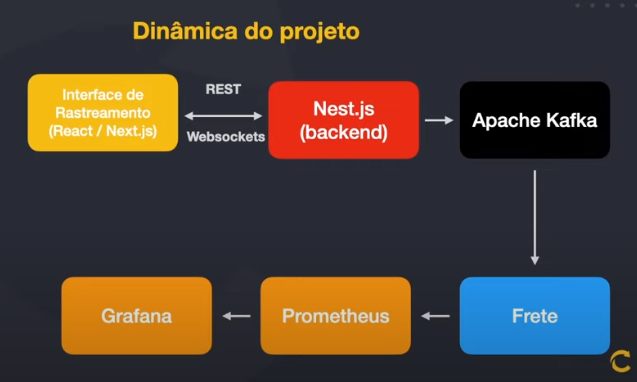
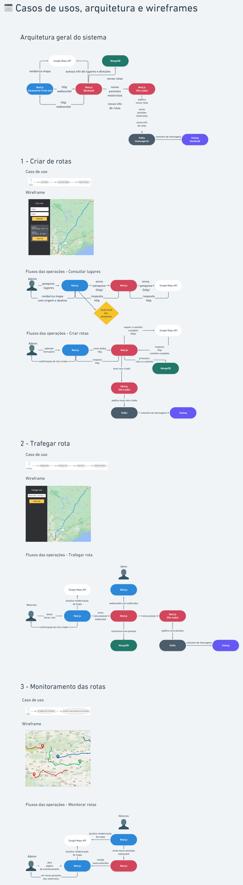

# Imersão FullCycle & FullStack 14 - Rastreamento Veicular

> Projetos do evento Imersão FullCycle & FullStack 14 - Rastreamento Veicular da FullCycle / CodeEdu

## Tecnologias

- Docker
- Linguagem Go
- Typescript / Javascript
- Nest.js / Node.js
- Next.js / React.js
- MongoDB
- MySQL
- Web sockets
- Apache Kafka
- Prometheus
- Grafana
- Google Maps API

## Dinâmica do projeto / Arquitetura Geral

## Dia 1 - Microsserviço backend para o rastreamento

### Tecnologias

- Typescript / Javascript
- Nest.js / Node.js
- Prisma ORM
- MongoDB
- Rest
- Google Maps API

## Dia 2 - Frontend de rastreamento

### Tecnologias

- Typescript / Javascript
- Next.js
- React.js / React server components
- Google Maps API

## Dia 3 - Integração do Backend, Frontend e Apache Kafka

### Tecnologias

- Idem Aula 2 +
- Route handler / Next API
- Material UI
- Web sockets / Socket.io
- Apache Kafka
- Bulljs no Nest.js
- Prometheus

## Dia 4 - Microsserviço de cálculo de frete

### Tecnologias

- Go lang
- MySQL
- Apache Kafka
- Docker

## Dia 5 - Métricas e dashboard com Prometheus e Grafana

### Tecnologias

- Idem aula 4 +
- Prometheus
- Grafana

## Slides

## Projetos

- [Nest.js Backend](https://github.com/rodolfoHOk/fullcycle.imersao14/tree/main/backend-nestjs)

- [Go Backend](https://github.com/rodolfoHOk/fullcycle.imersao14/tree/main/backend-go)

- [Next Frontend](https://github.com/rodolfoHOk/fullcycle.imersao14/tree/main/frontend-nextjs)
